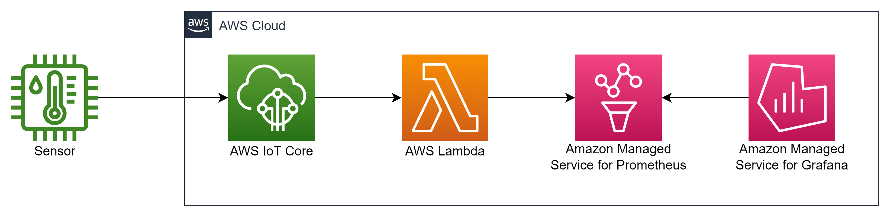
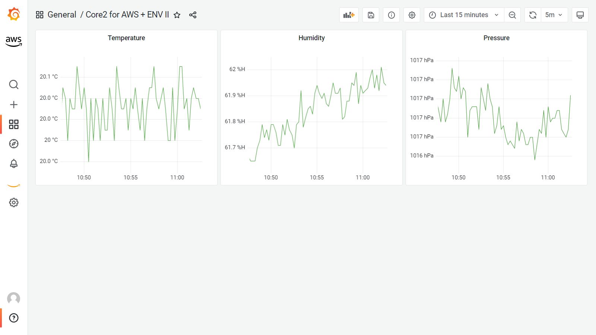

# iot2aps-lambda

This is AWS Lambda implementation of IoT Rule Action that sends iot data to AMP (Amazon Managed Service for Prometheus).

Architecture




Grafana Dashboard




## MQTT Payload

```json
{
  "temperature": 20.1,
  "humidity": 60.5,
  "pressure": 1024
}
```


## Prerequired

* Python 3.9
* AWS CLI
* AWS SAM CLI


## How to Use

### get src

```
git clone https://github.com/moritalous/iot2aps-lambda.git
```

### build

```
cd iot2aps-lambda/iot2aps-lambda/
```

```
sam build
```

### deploy

```
sam deploy --guided
```

Property values below

| Guide | Setting value | example |
| --- | --- | --- |
| Parameter WorkspaceIdParameter | Prometheus Workspace ID | ws-05871e4c-f715-4877-b880-fa1bda971965 |
| Parameter MetricsNameParameter | Prometheus Metrics Name (`__name__`) | sensor_metrics |
| Parameter TopicParameter | IoT Rule Action Topic Name | topic/sensor |


Creating AWS Resource

| LogicalResourceId | ResourceType |
| --- | --- |
| IoT2ApsFunctionIoTRulePermission | AWS::Lambda::Permission |
| IoT2ApsFunctionIoTRule | AWS::IoT::TopicRule |
| IoT2ApsFunctionRole | AWS::IAM::Role |
| IoT2ApsFunction | AWS::Lambda::Function |
